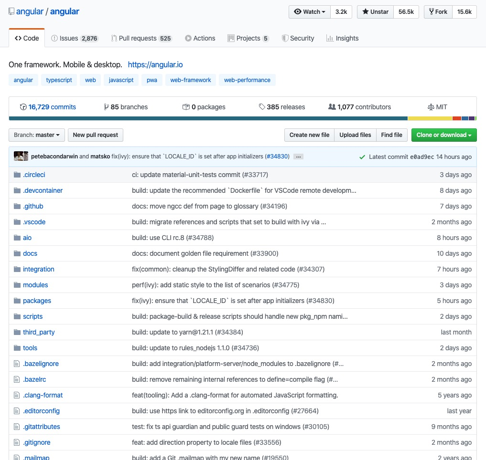
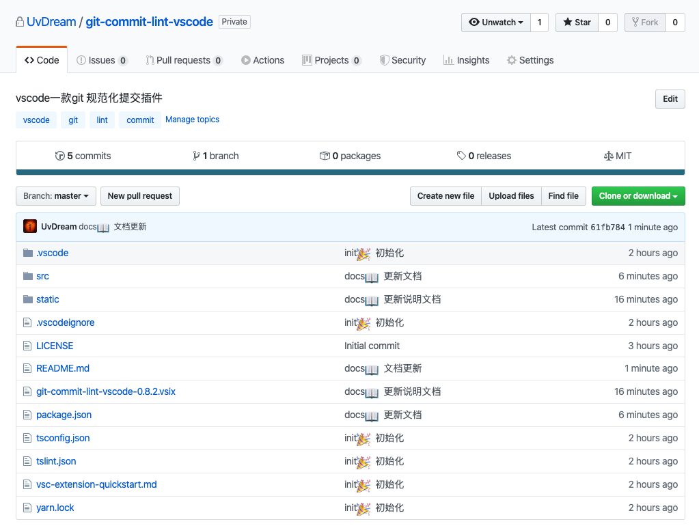
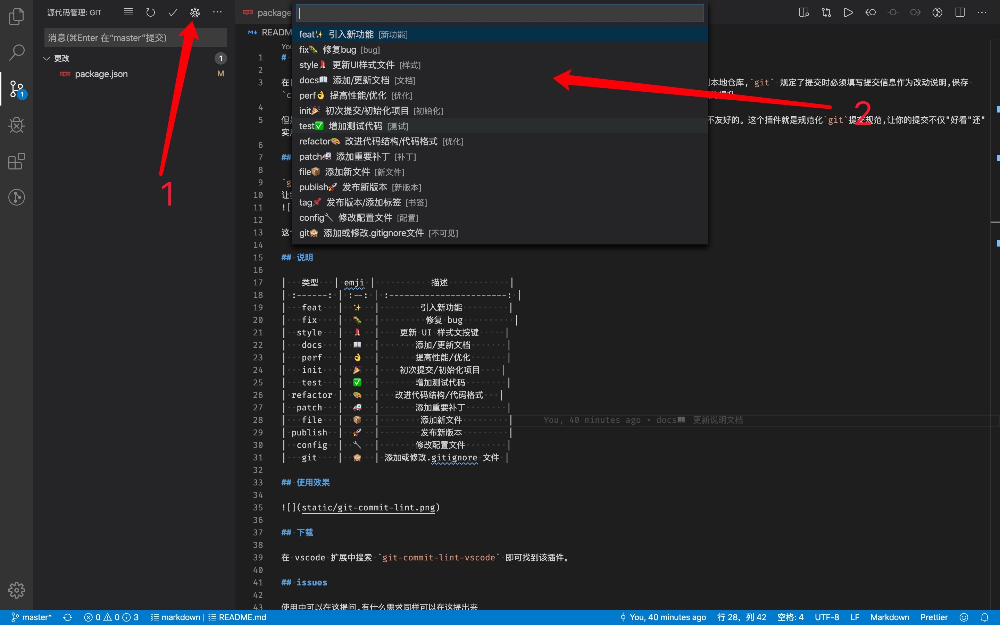
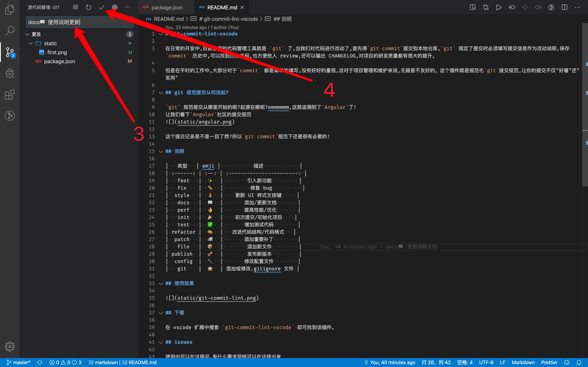

# git-commit-lint-vscode

在日常的开发中,目前主流的代码管理工具就是 `git` 了,当我们对代码进行改动了,首先得`git commit`提交到本地仓库,`git` 规定了提交时必须填写提交信息作为改动说明,保存 `commit` 历史中,可以找到历史代码,也方便他人 review,还可以输出 CHANGELOG,对项目的研发质量都有很大的提升。

但是在平时的工作中,大部分对于`commit` 都是简单的填写,没有好好的重视,这对于项目管理和维护来说,无疑是不友好的。这个插件就是规范化`git`提交规范,让你的提交不仅"好看"还"实用"

## git 规范提交从何说起?

`git` 规范提交从哪里开始的呢?起源在哪呢?emmmmmm,这就追溯到了`Angular`了!
让我们看下`Angular`社区的提交规范

这个提交记录是不是一目了然?所以`git commit`规范下还是很有必要的!

## 说明

|   类型   | emji |           描述            |
| :------: | :--: | :-----------------------: |
|   feat   |  ✨  |        引入新功能         |
|   fix    |  🐛  |         修复 bug          |
|  style   |  💄  |    更新 UI 样式文按键     |
|  format  |  🥚  |        格式化代码         |
|   docs   |  📝  |       添加/更新文档       |
|   perf   |  👌  |       提高性能/优化       |
|   init   |  🎉  |    初次提交/初始化项目    |
|   test   |  ✅  |       增加测试代码        |
| refactor |  🎨  |   改进代码结构/代码格式   |
|  patch   |  🚑  |       添加重要补丁        |
|   file   |  📦  |        添加新文件         |
| publish  |  🚀  |        发布新版本         |
|   tag    |  📌  |        发布新版本         |
|  config  |  🔧  |       修改配置文件        |
|   git    |  🙈  | 添加或修改.gitignore 文件 |

## 使用效果

## 使用说明

- 1
  
- 2
  

## 下载

在 vscode 扩展中搜索 `git-commit-lint-vscode` 即可找到该插件。

## 插件配置

你可以在 vscode 的 文件 -> 首选项 -> 设置 -> 扩展 -> git-commit-lint-vscode 中对该插件进行配置，目前可选的配置项为：
1. 是否覆盖提交内容，默认为是。如果取消勾选，则会在之前的提交信息前插入 emoji 或者 code。
2. 使用 emoji 还是 code（兼容之前的设置方式），默认为 emoji。如果选为 code，则插入的信息中会移除 emoji 字符

## issues

使用中可以在这提问,有什么需求同样可以在这提出来

https://github.com/UvDream/git-commit-lint-vscode/issues
