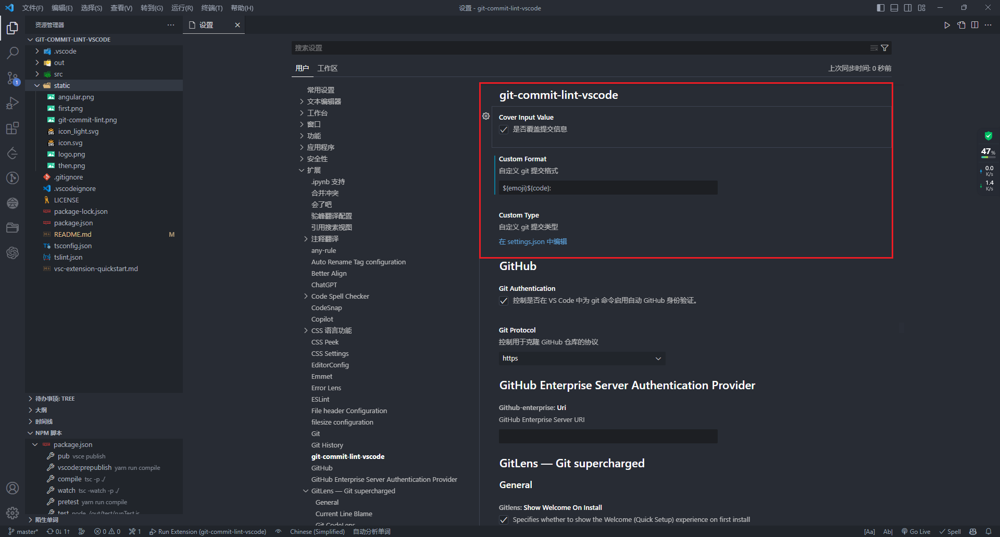

English | [中文](./README.zh-CN.md)

# git-commit-lint-vscode

In daily development, the mainstream code management tool is currently `git`. When we make changes to the code, we first need to `git commit` to submit it to the local repository. `git` requires that when submitting, we must fill in the submission information as a description of the changes, which will be saved in the `commit` history. This makes it possible to find historical code, facilitates review by others, and can also output a CHANGELOG, which greatly improves the development quality of the project.

However, in our usual work, most people simply fill in the `commit` without paying much attention to it, which is undoubtedly unfriendly to project management and maintenance. This plugin is used to standardize the `git` submission specifications, making your submission not only "good-looking" but also "practical."

## Where to start with standardizing `git` submissions?

Where does the standardization of `git` submissions begin? Where does it originate? Well, this can be traced back to `Angular`! Let's take a look at the submission specifications of the `Angular` community.


Isn't this commit record clear at a glance? Therefore, it is still necessary to follow the `git commit` specifications!

## explain

|   类型   | emji |                  描述                  |
| :------: | :--: | :------------------------------------: |
|   feat   |  ✨  |        Introducing new features        |
|   fix    |  🐛  |                fix bugs                |
|  style   |  💄  |      Update UI style text button       |
|  format  |  🥚  |              format code               |
|   docs   |  📝  |        Add/Update Documentation        |
|   perf   |  👌  |      Improve performance/optimize      |
|   init   |  🎉  |   Initial commit/initialize project    |
|   test   |  ✅  |             Add test code              |
| refactor |  🎨  | Improve code structure/code formatting |
|  patch   |  🚑  |          Add critical patches          |
|   file   |  📦  |              add new file              |
| publish  |  🚀  |         release a new version          |
|   tag    |  📌  |             post a new tag             |
|  config  |  🔧  |     Modify the configuration file      |
|   git    |  🙈  |     Add or modify .gitignore files     |

## usage effect


## instructions

- 1
  
- 2
  

## download

You can search for the `git-commit-lint-vscode` plugin in the VS Code extensions marketplace.

## plug-in-configuration



You can configure the `git-commit-lint-vscode` plugin by going to File -> Preferences -> Settings -> Extensions -> git-commit-lint-vscode in VS Code. Currently available configuration options are:

1. Accurate Locating: Whether to accurately locate the input box of the selected repository when there are multiple repositories, default is `No`. Note: This feature works correctly in most cases, but if your source code management repository has multiple repositories, such as selecting only part of the repository or the order is incorrect, the wrong input box will be selected.
2. Cover Input Value: Whether to cover the commit message, default is `Yes`. If unchecked, an emoji or code will be inserted before the previous commit message.
3. Custom Format: Custom git commit format, default is `${emoji}${code}: `. The parameters are taken from the `key` in `Custom Type`, and can be fully customized.
4. Custom Type: Custom git commit types, default is

```json
[
  {
    "emoji": "✨",
    "type": "feat",
    "name": "引入新功能",
    "description": "新功能"
  },
  {
    "emoji": "🐛",
    "type": "fix",
    "name": "修复bug",
    "description": "bug"
  },
  {
    "emoji": "💄",
    "type": "style",
    "name": "更新UI样式文件",
    "description": "样式"
  },
  {
    "emoji": "🥚",
    "type": "format",
    "name": "格式化代码",
    "description": "格式化"
  },
  {
    "emoji": "📝",
    "type": "docs",
    "name": "添加/更新文档",
    "description": "文档"
  },
  {
    "emoji": "👌",
    "type": "perf",
    "name": "提高性能/优化",
    "description": "优化"
  },
  {
    "emoji": "🎉",
    "type": "init",
    "name": "初次提交/初始化项目",
    "description": "初始化"
  },
  {
    "emoji": "✅",
    "type": "test",
    "name": "增加测试代码",
    "description": "测试"
  },
  {
    "emoji": "🎨",
    "type": "refactor",
    "name": "改进代码结构/代码格式",
    "description": "优化"
  },
  {
    "emoji": "🚑",
    "type": "patch",
    "name": "添加重要补丁",
    "description": "补丁"
  },
  {
    "emoji": "📦",
    "type": "file",
    "name": "添加新文件",
    "description": "新文件"
  },
  {
    "emoji": "🚀",
    "type": "publish",
    "name": "发布新版本",
    "description": "新版本"
  },
  {
    "emoji": "📌",
    "type": "tag",
    "name": "发布版本/添加标签",
    "description": "书签"
  },
  {
    "emoji": "🔧",
    "type": "config",
    "name": "修改配置文件",
    "description": "配置"
  },
  {
    "emoji": "🙈",
    "type": "git",
    "name": "添加或修改.gitignore文件",
    "description": "不可见"
  }
]
```

## participation contribution

Although it's just a small plugin, and maybe not many people use it, but thanks to all the contributors!

<a href="https://github.com/UvDream/git-commit-lint-vscode/graphs/contributors">
  
</a>

## issues

During use, you can ask questions here, and any requirements can also be raised here.

https://github.com/UvDream/git-commit-lint-vscode/issues
